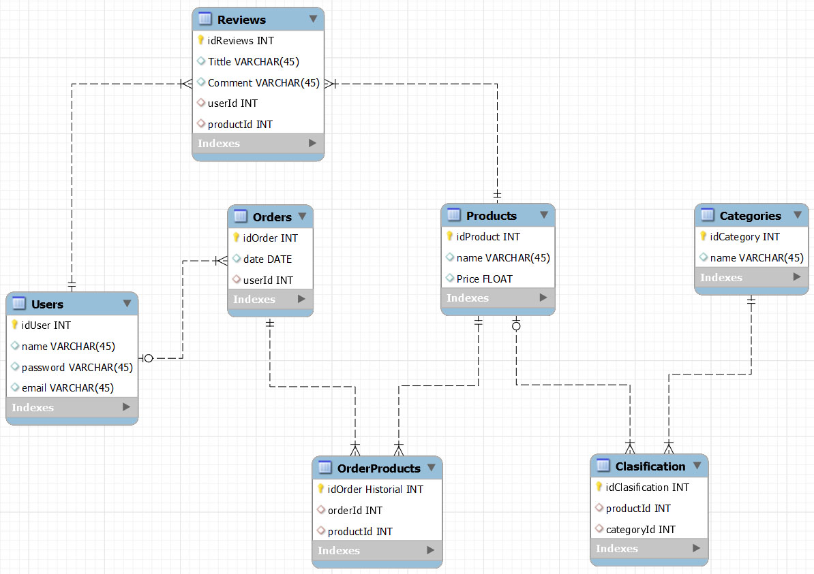

# ECOMMERCE - PROYECTO BACKEND

En este proyecto encontramos una base de datos relacional que simula una tienda online. Los datos que almacenamos dentro de esta base de datos son:
- Usuarios.
- Órdenes.
- Productos.
- Categoría de productos.
- Reseñas.

Para poder realizarla, utilizamos un entorno de ejecución (NODE), con frameworks, ORM y junto algunos middlewares que mencionaremos más adelante.
El diagrama que representa esta base de datos es la siguiente:

## Comenzando 🚀

Para poder desplegar el proyecto correctamente, desde GitHub y con el acceso correspondiente al repositorio de la web, clonar el repositorio en su ordenador.

## Ejecutando Bootstrap ⌨️

Para poder ejecutar Bootstrap, debemos instalarlo en nuestro HTML dentro del <head>.
jsDelivr es un CDN (red de distribución de contenidos). Es un grupo de servidores distribuidos en muchas ubicaciones. Estos servidores almacenan copias duplicadas de datos para que los servidores puedan cumplir con las solicitudes de datos en función de qué servidores están más cerca de los respectivos usuarios finales.

Omita la descarga con jsDelivr para entregar la versión en caché de CSS y JS compilados de Bootstrap a su proyecto.

Si está utilizando JavaScript compilado, no olvide incluir versiones CDN de jQuery y Popper js antes.

Nosotros hemos utilizado:

  <link href="https://cdn.jsdelivr.net/npm/bootstrap@5.0.2/dist/css/bootstrap.min.css" rel="stylesheet"
        integrity="sha384-EVSTQN3/azprG1Anm3QDgpJLIm9Nao0Yz1ztcQTwFspd3yD65VohhpuuCOmLASjC" crossorigin="anonymous">
    
    
    

Es importante destacar, que la etiqueta "defer" permite colocar los script en el head sin que cree conflicto con la lectura de Javascript y todo el contenido del body, permite crear una asincronía que hará que sea lo último que se lea independientemente de su posición en el head.

## Ejecutando JavaScript ⌨️

Dentro del <head> del HTML introducimos 
Con la etiqueta "defer" podemos colocarlo en el head por lo ya explicado anteriormente y vinculamos el archivo .js al archivo .html.

En los códigos JavaScript encontramos funciones del tipo:

- const response = await axios.get(API_URL); --- (Llamamos una API que nos permite utilizar información almacenada en el servidor)

- homeLink.addEventListener("click", showQuiz); --- (Un evento que nos permite navegar entre páginas con el modelo SPA).

- De condición (if, else if, else) --- (Se realizan ciertas acciones cuando se cumplen las condiciones o no se cumplen).

- localStorage.setItem("scores", JSON.stringify(totalScores)); --- (Subir el score del Quiz al Local Storage haya o no contenido previo en la array de scores, para crear un historial y posteriormente utilizarla en combinación con el código inferior).

- totalScores = JSON.parse(localStorage.getItem("scores")) || []; --- (Acceder a la información del local storage y consultar el histórico de scores).

- setTimeout(function ()) {}; --- (Realizar acciones una vez transcurrido el tiempo definido, automatiza el test para pasar a la siguiente pregunta).

- button.disabled = true; --- (Bloquea los botones de respuesta una vez se ha seleccionado una de las opciones).

- function shuffleArray(array) {}; --- (Función que coge las cuatro posibles respuestas, las mezcla, y las devuelve en un array con posición aleatoria).

- const myGrafic = new Chart(grafic, {}); --- (Variable que se utiliza para dibujar un gráfico).

## Ejecutando Axios ⌨️

 --- (Código que utilizamos para instalar Axios).
Axios es una librería JavaScript que puede ejecutarse en el navegador y que nos permite hacer sencillas las operaciones como cliente HTTP.

## Ejecutando ChartJS - Gráfico ⌨️

 --- (Código que utilizamos para instalar ChartJs). ChartJs es una libreria que proporciona un modelo de graficos, el cual podemos implementar en nuestros proyectos web.

<canvas id="grafica" class="mt-3" height="300" width="300"></canvas> --- (En el código HTML especificaremos donde aparecerá la gráfica dentro de la etiqueta <canvas>).

## Construido con 🛠️

_Menciona las herramientas que utilizaste para crear tu proyecto_

* [*VISUAL STUDIO CODE*](https://code.visualstudio.com/) - Code editor used (Version: 1.75.1)
* [*Live Server*](https://marketplace.visualstudio.com/items?itemName=ritwickdey.LiveServer) - Manejador de dependencias
* [*GitHub*](https://github.com/) - Almacenamiento de repositorios
* [*Bootstrap*](https://getbootstrap.com/) - framework front end CSS y Javascript (Usada esta web para sus componentes)
* [*Axios*](https://axios-http.com/es/docs/intro) - librería JavaScript (Usada para poder acceder a la API de https://opentdb.com/)
* [*ChartJS*](https://www.chartjs.org/) - biblioteca JavaScript (Usada para la visualización de datos.)

## Versionado 📌

Usamos [SemVer](http://semver.org/) para el versionado. Para todas las versiones disponibles, mira los [tags en este repositorio](https://github.com/GuilleSoler87/Quiz_JavaScript.git).

## Autores ✒️

* **Guillermo Soler Fernández** - *Proyecto Quiz - JavaScript* - [GuilleSoler87](https://github.com/GuilleSoler87)

* **Volodymyr Kolomiiets** - *Proyecto Quiz - JavaScript* - [VolodymyrKolomiets](https://github.com/VolodymyrKolomiets)

## Licencia 📄

Este proyecto actualmente no tiene licencia. Puede usarse todo su contenido sin el requisito de la misma.